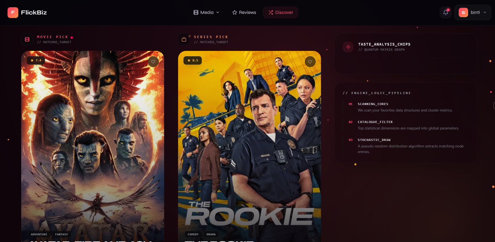
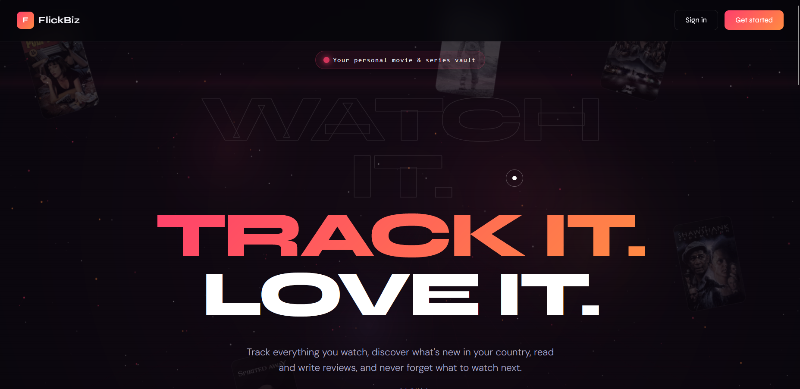
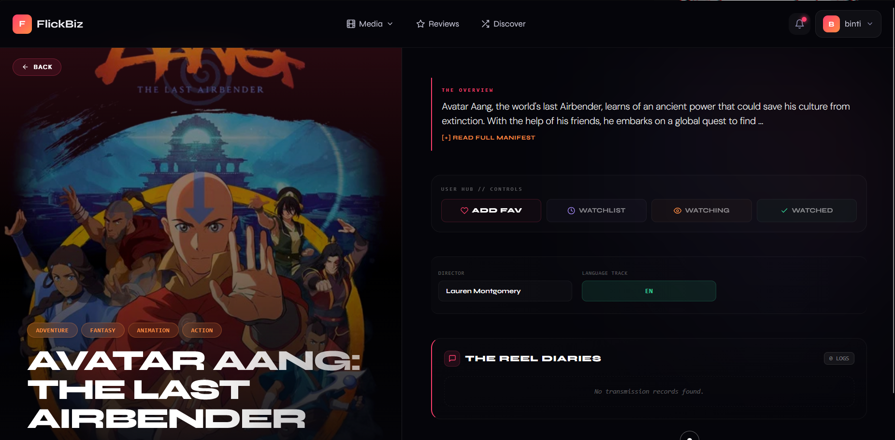
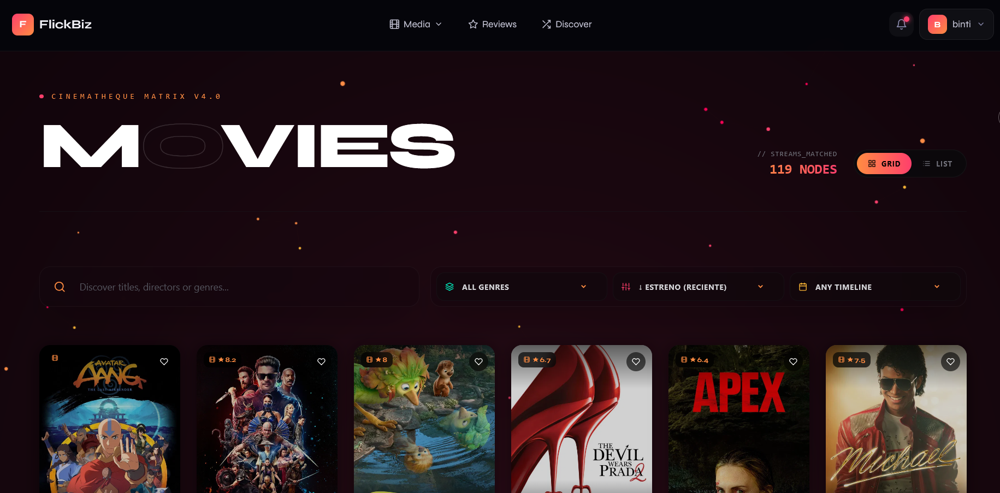
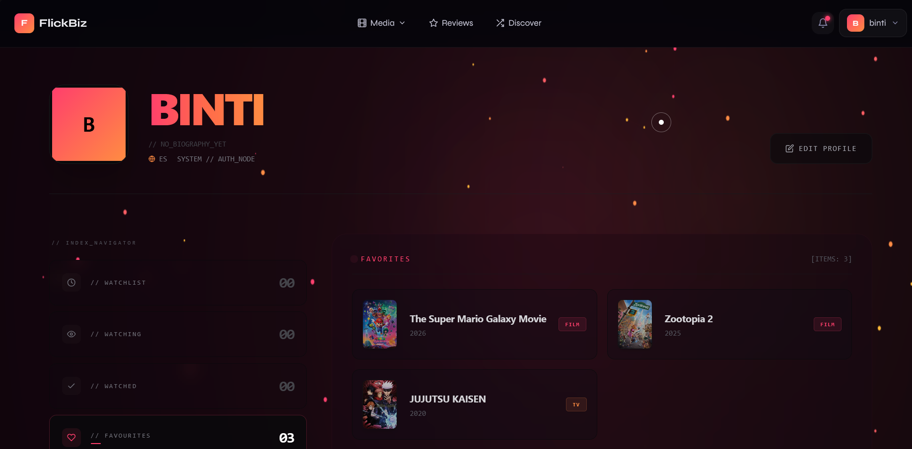
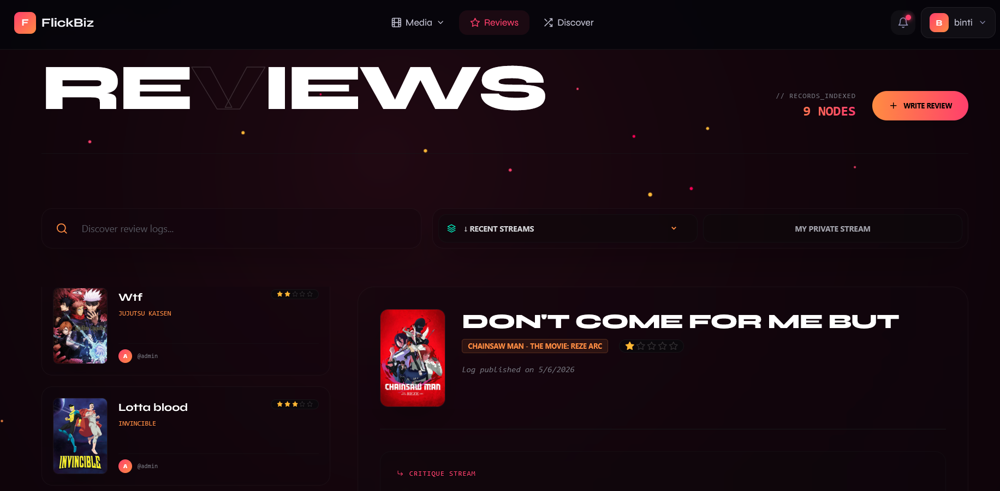

#  FlickBiz - Plataforma de Seguimiento Cinematográfico y Reseñas

FlickBiz es un ecosistema web diseñado para centralizar, organizar y optimizar la experiencia del consumo multimedia actual. Ante la fragmentación del catálogo del entretenimiento (con contenidos repartidos en múltiples servicios de streaming y televisión a la carta), la aplicación nace como una solución integral que devuelve el control al espectador.

A diferencia de los catálogos comerciales tradicionales, FlickBiz no depende de algoritmos de recomendación sesgados por intereses de distribución. En su lugar, prioriza una arquitectura de datos limpia y un enfoque puramente comunitario, permitiendo a los usuarios registrar de forma granular el estado de sus visionados, redactar críticas analíticas detalladas con puntuaciones reales, interactuar con la comunidad y consultar en tiempo real qué proveedores de streaming ofrecen ese contenido dentro de su territorio geográfico.

## 🎯 Objetivos del Proyecto

- **Centralización del catálogo:** Proveer una interfaz unificada donde clasificar y monitorizar el estado de series y películas sin importar su plataforma de origen.
- **Interacción comunitaria orgánica:** Implementar un sistema de debate y validación de reseñas mediante votaciones transparentes entre usuarios.
- **Modularidad y eficiencia:** Diseñar una base de datos relacional orientada a objetos que segregue metadatos y optimice las consultas del servidor reduciendo la duplicidad de registros.

## 🛠️ Tecnologías Utilizadas

### Frontend (Interfaz de usuario)

- **React:** Librería principal para la construcción de una interfaz interactiva basada en componentes reutilizables y gestión de estado global.
- **HTML5 y CSS3:** Estructura semántica avanzada y diseño adaptivo integrado en el flujo de componentes.
- **JavaScript (ES6+):** Consumo asíncrono de la API del backend mediante peticiones HTTP (Fetch/Axios) para actualizar la UI sin recargar el navegador.

### Backend (Servidor y Lógica de Negocio)

- **Django (Python):** Motor principal del entorno, encargado de la API REST, el ORM de datos, el enrutamiento seguro y las reglas de negocio.
- **PostgreSQL:** Sistema de gestión de bases de datos relacionales potente y escalable para la persistencia del núcleo de la app.
- **JWT (JSON Web Tokens):** Protocolo de seguridad robusto basado en tokens firmados para la autenticación de sesiones desde el cliente React y protección de rutas privadas.

## 📂 Estructura del Repositorio

Para facilitar la navegación por el código, el proyecto está estructurado de la siguiente manera:

```
├─ flickbiz_back/                     # Directorio raíz del proyecto Backend (Django)
│  ├── apps/                          # Módulos o aplicaciones internas que dividen la lógica del negocio
│  │  ├── media/                      # Gestión de películas y series
│  │  │  └── management/              # Scripts personalizados de administración de Django
│  │  │     └── commands/             # Comandos de terminal propios
│  │  ├── notifications/              # Lógica para crear, almacenar y enviar avisos asíncronos a los usuarios
│  │  ├── reviews/                    # Módulo encargado de las reseñas críticas y el contador de "Me gusta"
│  │  └── users/                      # Gestión de perfiles de usuario, registros y lógica de autenticación
│  ├── flickbiz_back/                 # Carpeta de configuración central del proyecto Django
│  │  ├── __init__.py                 # Archivo técnico que indica a Python que esta carpeta es un paquete
│  │  ├── settings.py                 # Ajustes principales del servidor
│  │  └── urls.py                     # Enrutador principal de la API; mapea las direcciones web hacia las vistas
│  ├── manage.py                      # Script de consola principal para interactuar con Django (migraciones, servidor, etc.)
│  └── requirements.txt               # Listado de librerías y dependencias de Python necesarias para que funcione el backend
│
│
├─ flickbiz_front/                    # Directorio raíz del proyecto Frontend (React)
│  ├── src/                           # Código fuente principal de la interfaz de usuario
│  │  ├── components/                 # Piezas visuales reutilizables de la web (botones, barras de navegación, tarjetas)
│  │  ├── context/                    # Estado global de React (ej. para mantener la sesión del usuario activa en toda la app)
│  │  ├── hooks/                      # Funciones lógicas personalizadas de React para extraer y reutilizar comportamiento
│  │  ├── pages/                      # Vistas o pantallas completas de la aplicación (Home, Login, Ficha de Película)
│  │  ├── services/                   # Capa encargada de hacer las peticiones HTTP (Axios/Fetch) a la API de Django
│  │  ├── App.jsx                     # Componente raíz donde se configuran las rutas de navegación de la app
│  │  └── index.css                   # Estilos CSS globales de la aplicación y directivas de Tailwind
│  ├── .gitignore                     # Especifica qué archivos pesados o sensibles (como node_modules) no deben subir a GitHub
│  ├── README.md                      # Guía de presentación, instalación y especificaciones del proyecto
│  ├── package-lock.json              # Registro estricto de las versiones exactas instaladas de cada dependencia de Node
│  ├── package.json                   # Listado de dependencias del frontend (React, librerías de iconos) y scripts de arranque
│  └── tailwind.config.js             # Archivo de configuración para personalizar los estilos, colores y fuentes de Tailwind CSS
```

## 📸 Capturas de Pantalla

|                  Discover                  |               Landing Page               |                   Media Details                    |
| :----------------------------------------: | :--------------------------------------: | :------------------------------------------------: |
|  |  |  |

|                Media                 |                 Profile                  |                 Reviews                  |
| :----------------------------------: | :--------------------------------------: | :--------------------------------------: |
|  |  |  |

## ⚙️ Instalación y Uso Local

Sigue estos pasos detallados para configurar el entorno de desarrollo y ejecutar la aplicación de forma local en tu ordenador:

### 1. Clonar el repositorio

Descarga una copia exacta del código fuente en tu máquina local:

```bash
git clone https://github.com/tu-usuario/flickbiz.git
```

### 2. Configurar el Backend (Django)

Es recomendable aislar los paquetes del proyecto. Crea un entorno virtual e instala los requerimientos del sistema:

Entrar a la carpeta del backend o mantener la raíz si está unificado

```
python -m venv venv
```

Activar entorno (En Windows)

```
venv\Scripts\activate
```

Activar entorno (En Linux/Mac)

```
source venv/bin/activate
```

Instalar dependencias del servidor

```
pip install -r requirements.txt
```

Crear las tablas en la Base de Datos ejecutando las migraciones

```
python manage.py migrate
```

Iniciar el servicio local de Django

```
python manage.py runserver
```

### 3. Configurar el Frontend (React)

Abre una nueva terminal para instalar los módulos de Node y levantar el servidor de desarrollo de la interfaz:
Bash

Entrar a la carpeta del frontend

```
cd frontend
```

Instalar los paquetes y dependencias de React

```
npm install
```

Iniciar el entorno de desarrollo de React

```
npm start
```

### 4. Acceso a la plataforma

Una vez que ambos servidores estén corriendo, abre tu navegador e introduce la dirección local de React:
👉 http://localhost:3000/

---

Desarrollado por bintidev. Todos los derechos reservados.
